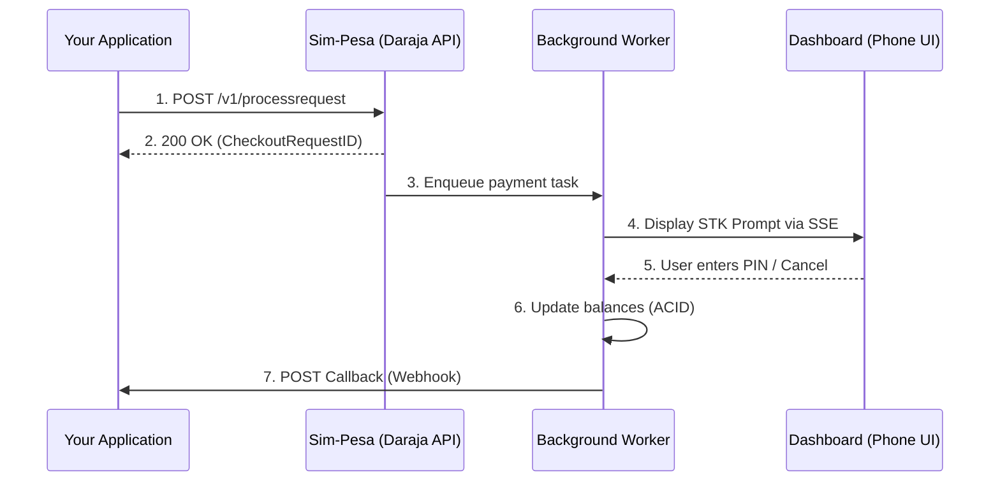

# How M-Pesa Works

Integrating with M-Pesa requires understanding its asynchronous nature. Payments are not instant; they are requests that depend on user interaction and external system availability.

## The STK Push Lifecycle

STK Push (ShortCode-to-Key) is a merchant-initiated payment where the customer receives a prompt on their handset to enter their M-Pesa PIN.

### 1. Initiation & Acknowledgment
Your application initiates a request. The API validates the payload and returns an acknowledgment containing a `CheckoutRequestID`. This is **not** a confirmation of payment; it only confirms the request was accepted for processing.

### 2. The PIN Prompt
The customer sees a popup on their phone displaying the amount and merchant name. They must enter their 4-digit PIN to authorize the transfer.

### 3. The Callback (Webhook)
Once the user interacts with the prompt (or it times out), M-Pesa sends a POST request to your `CallBackURL`. This payload contains the `ResultCode` and `ResultDesc` indicating the final outcome (Success, Wrong PIN, Cancelled, etc.).

**Processing the callback is the only way to confirm a payment.**

## Architectural Requirements

### Public Endpoints
In production, your `CallBackURL` must be a publicly accessible HTTPS endpoint. Safaricom's systems cannot reach `localhost`. (Sim-Pesa allows `http://host.docker.internal` for local development).

### Asynchronicity
Your application must be designed to handle the delay between Step 2 (Acknowledgment) and Step 7 (Callback). This usually involves storing the `CheckoutRequestID` and updating your order status once the webhook arrives.

### Idempotency
Duplicate requests can happen due to network retries. You must use the `ExternalReference` or `CheckoutRequestID` to ensure you don't process the same payment twice. Sim-Pesa helps test this with its built-in fingerprinting.

## Why Async?
M-Pesa uses an asynchronous model to handle:
- **Handset Latency** -- Users may not have their phones immediately available.
- **Network Reliability** -- SMS and USSD signals are not guaranteed to be instantaneous.
- **Scalability** -- Decoupling ingestion from authorization allows the system to handle millions of concurrent requests without blocking.
