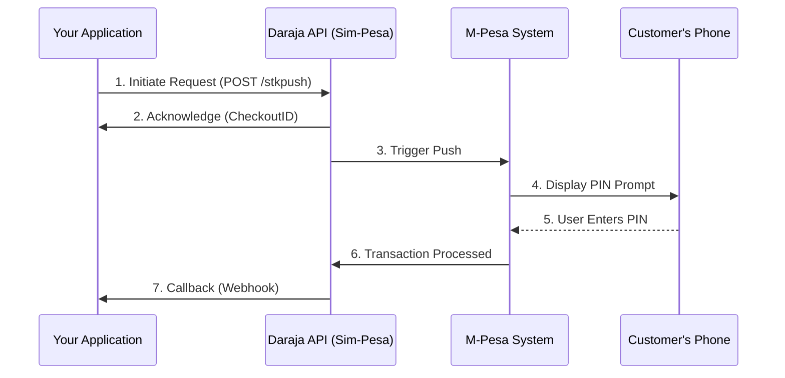

# How M-Pesa Actually Works

Understanding the underlying M-Pesa architecture is key to building robust integrations. M-Pesa (via the Daraja API) primarily uses an **asynchronous** flow for mobile-originated payments (STK Push).

## The STK Push Flow
STK Push (Shortcode-to-Key) is a method where the merchant initiates a payment request to the customer's phone.

### 1. Ingestion & Acknowledgement
When you send a request to Daraja, it doesn't process the payment immediately. Instead, it validates the request and returns a `CheckoutRequestID`. This is Daraja saying, "I've received your request and will try to reach the customer."

### 2. The PIN Prompt
The customer receives a popup on their phone asking for their M-Pesa PIN. This happens outside of your application's control.

### 3. The Callback (Webhook)
Since the user might take seconds or minutes to enter their PIN (or might never do it), the process is asynchronous. Once the transaction is finalized (Success, Cancel, or Timeout), M-Pesa sends a **Callback** to the `CallBackURL` you provided in the initial request.

**This is the most critical part of your integration.** You must have a public-facing endpoint that can receive and process this JSON payload.

## Why is it Async?
- **User Latency:** Users might be away from their phones.
- **Network Latency:** SMS and USSD/STK signals can be delayed.
- **Concurrency:** Millions of transactions happen simultaneously; blocking until a user enters a PIN is not scalable.

## Common Pitfalls
- **Ignoring the Callback:** Only relying on the acknowledgement (Step 2) is a mistake. Step 2 only means the request was *accepted*, not *paid*.
- **Timeouts:** M-Pesa usually gives the user about 30-60 seconds to enter their PIN.
- **Idempotency:** If a user clicks "Pay" twice, you should handle it gracefully to avoid double-charging. (Sim-Pesa helps you test this with its fingerprinting feature!)
